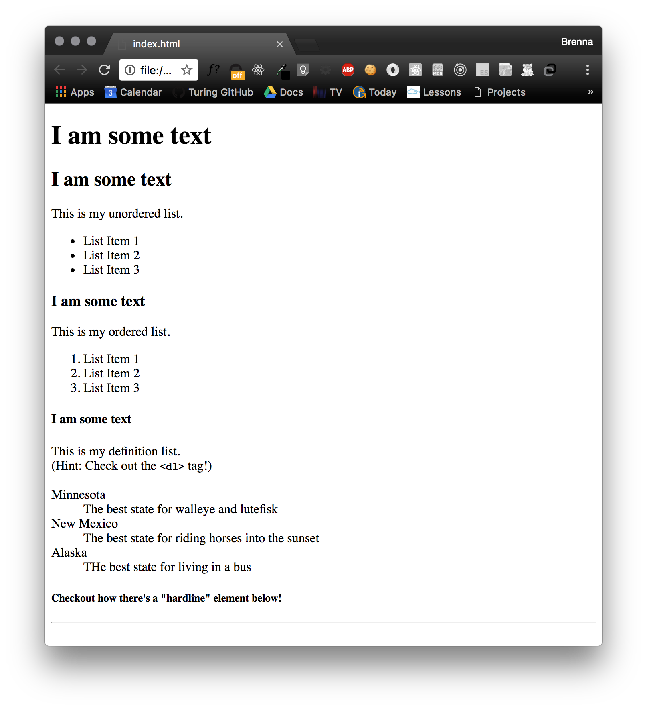
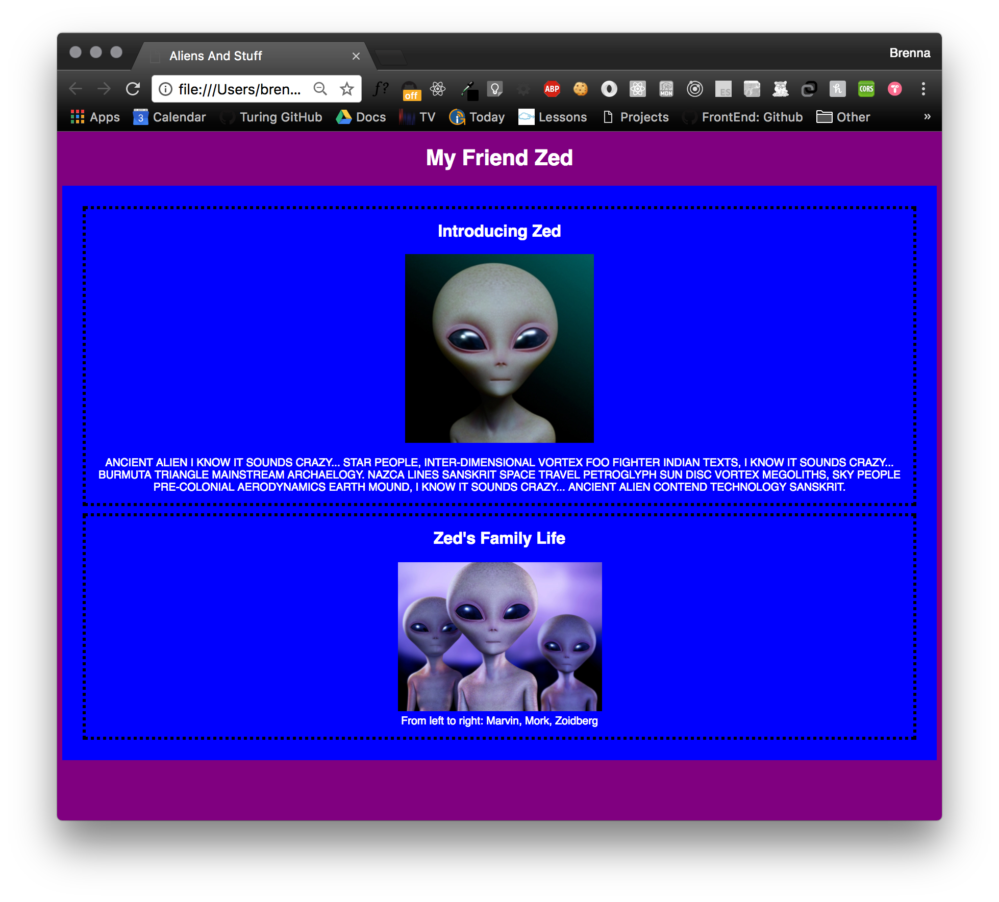
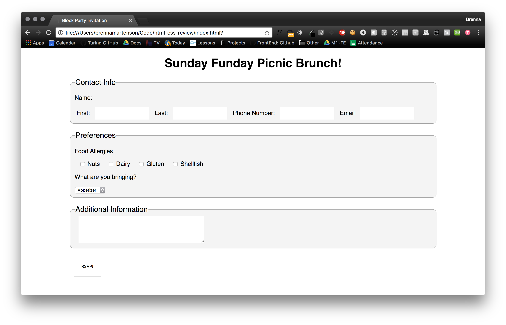
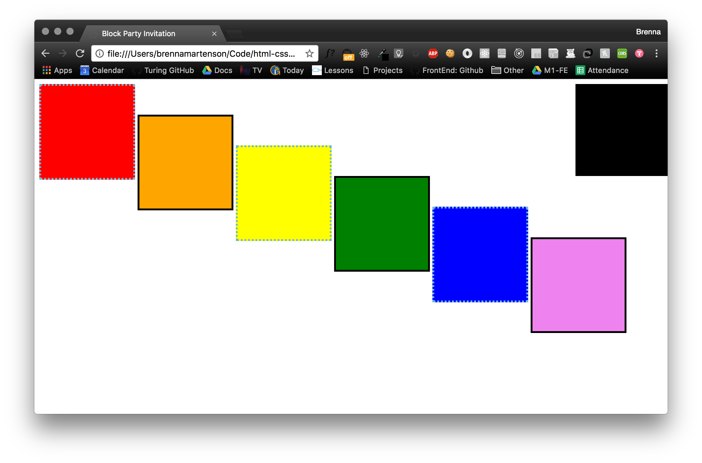

## Week 1 Review

### The Game Plan
The following exercises will help to build up some muscle memory on the vocabulary and syntax we have talked about this week. Now is the time to start applying what we talk about in class to independent projects.   

As always, we will throw in some curveballs that we haven't talked about yet. Take a second to experiment with some possible solutions before you google. If they don't work - thats ok! Learning a new language is as much about errors as it is about getting things right.

### Rules
1. Complete each mini challenge.
  * You are welcome to use [codepen](http://www.codepen.io) for this, although you are strongly encouraged to create a directory on your computer and start getting used to building things in Atom instead.
  * An additional benefit of using Atom is that you'll have some examples to reference for the rest of the mod locally on your computer.  

2. GET AS FAR AS YOU CAN BEFORE GOOGLING.  

  The following should be your plan of attack for the rest of this mod:
  * **Start completely from memory**. When you reach a road block and you don't know what to type next, take a solid minute to stop and just THINK about the challenge before asking google/your neighbor/your notebook for an answer. Your brain absorbs more than you think it does!  
  - Once you really can't remember, **check your notebook first**. You should be taking hand-written notes as much as you can. Before you can build muscle memory, your brain needs to understand what the goal is. Studies show that using a pen and paper slows down the thought process to solidify new information more than taking notes on a computer does.
  - If you didn't take handwritten notes, **try the interwebs**. There's a pretty solid chance someone on StackOverflow has asked the same question you have.
  - If google fails you, or the search results are unclear, **ask your neighbor**! Then ask your other neighbor! Then ping your channel in slack!
  - **Ask Robbie**.

_____

## Challenges

#### HTML Skeleton
From scratch, create the template needed to start building an HTML page.  

**REMEMBER: TRY TO GET AS FAR AS YOU CAN WITHOUT LOOKING!**

Elements you'll need (in no particular order):
* `<html></html>` tags
* a DTD (Doctype Declaration)
* `<body>`
* `<head>`
* `<title`

Extension:  
* Create a `style.css` file in your project directory and link to that file in the head of your document.  

#### Headings and Lists
Match the comp below using **only HTML**.  

Elements allowed/required:  
* headers
* lists
* paragraph
* hardline

####  Sections, Articles, and CSS
Match the comp below using HTML and CSS.  
(Bonus: Turns out there's an [Alien Ipsum](http://ancientalienipsum.com/)!)

These are the images used in the comp:  
[Zed The Alien](http://dreamicus.com/data/alien/alien-01.jpg)  
[Zed's Family](http://www.livescience.com/images/i/000/049/468/original/aliens-ET.jpg)  

Elements allowed/required:  
* section
* article
* figure
* figcaption
* image
* paragraph

CSS Hints:
* The background color of the body should be `purple`;
* The section element should have a background color of `blue` and 20 pixels of padding.
* Google how to make text all capital using CSS. This style rule should be applied to the paragraph tag.
* Article elements should have a black dotted border of 5 pixels, and a margin of 5 pixels.  

Extension:  
* Grab a more interesting font from google!

  

#### Forms

Match the comp below using HTML and CSS.

Elements allowed/required:  
* form
* label
* textarea
* legend
* dropdown
* checkbox
* submit button
* fieldset

Additional Requirements:  
* All labels should have a `for` attribute.
* All input fields should have an `id`, `type`, and a `name`.

CSS Hints:
* The background color of the fieldsets should be `#f4f4f4`, with a 1px solid border of `#aaa`.
* Fieldsets should have a top and bottom margin, but no side margin.
* The form should be 80% wide, and centered on the page.
* The input fields should have no border, with some space between the label and the input field and a some padding.
* The input field with a type of submit should have a white background, and a 1px solid black border with 20px of padding.

#### IDs and Classes
Using only divs, match the following mock up. Because your elements are unique you'll need to use classes and ids so your css knows what to target.

CSS Hints:  
* Each box should be 150px by 150px.
* You can use english rainbow colors here( `red`, `orange`, `green`..etc)- or feel free to get weird with it.
* All of the boxes with a dotted border should have a class of `dotted`. The border should be 3 pixels, dotted, and the color `#6eb8d4`
* All of the boxes with a solid border should have a class of `solid`. The border should be 3 pixels, solid, and black.
* Each of the colored boxes should be relatively positioned 50 pixels further from the top than the previous box.
* The black box should be absolutely positioned 0px from the right.

